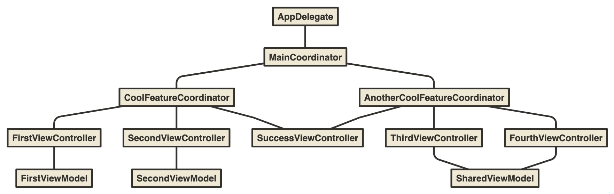

# UIFlow  - A navigation and data interaction framework for iOS projects



#### TL; DR

`UIFlow` is a framework to let the `Coordinator` handle the navigation and the `ViewModel` handle data interaction. 
You just need to make your `ViewControllers` subclass the `UIFlowViewController` and create `Coordinators` and `ViewModels` that will be used by these `ViewControllers`.

There is also a `Storyboarded` protocol that will instantiate your `ViewController` from a storyboard file with the same name. 
Now, if you are really interested in how this can make your life easier, please read this documentation fully, it will take only a few minutes, but you can also download the code and see it in action with the given `Demo` project.

In the end, your `ViewController` will look like this:

```swift
import UIFlow

class LoginViewController: UIFlowViewController<LoginViewModel, LoginViewNavigation> {
	
	@IBOutlet private weak var emailTextField: UITextField!
	@IBOutlet private weak var passwordTextField: UITextField!
	
	override func updateUI() {
		if let isLoggedIn = viewModel?.isLoggedIn, isLoggedIn {
			coordinator?.finishedLogin(self)
		}
	}
	
	@IBAction func userRegistrationButtonTouchUpInside(_ sender: Any) {
		coordinator?.goToUserRegistration(self)
	}
	
	@IBAction func loginButtonTouchUpInside(_ sender: Any) {
		viewModel?.login(email: emailTextField.text, password: passwordTextField.text)
	}
}
```

Thanks!

## What is it?

There are many design patterns, architectures and ideas out there about how an iOS app should be structured. Well, this this another one, but this is not a breaktrough disruptive framework that will blow your mind, this is a combination of ideas that worked pretty well for my needs. 

After working many years in many different app kinds and sizes, I saw that I could use a simple structure to handle most of them, but it should follow some principles:

* Easy to understand
* Easy to use
* Separate Model interaction from User interaction
* Make all ViewControllers isolated and testable
* Possibility to reuse ViewControllers in different flows without adding custom code on them
* Make it scalable

Nice list, right? Following these concepts, I came up with `UIFlow` and I hope it could help in your projects.

Oh, you might be asking *"What about SwiftUI?"*. That's a huge step in iOS development, but there are so many projects out there using `UIKit` that it is almost impossible to move to `SwiftUI` and older `iOS` versions would not be able to use it, so `UIFlow` could be a good possibility.

## Setup

#### CocoaPods

If you are using CocoaPods, add this to your Podfile and run `pod install`.

```Ruby
target 'Your target name' do
    pod 'UIFlow', '~> 1.0'
end
```

## How does it work?

Ok, let's start with the basics. `UIFlow` is so simple that it has only 4 public models:

* Storyboarded
* Coordinator
* ViewModel
* UIFlowViewController

Really, that's it? Yes! In general, this is how a simple app looks like:


See? Now let's talk about each part of it.

## Concepts

#### Storyboarded

Ok, if you prefer `NIBs` over `Storyboards`, feel free to move to the next concept, but after seeing this, you might change your mind. I like `Storyboards`, but only for designing a specific `ViewController`. 

I saw this protocol out there, it can instantiate a `ViewController` from the `initial view controller` of a `storyboard file with the same name` and fell in love with it, it is amazing! Here you can see how easy it is to use, let's say that we have created this `LoginViewController`:

* LoginViewController.storyboard
* LoginViewController.swift

This is how you use it in a `Coordinator`:

```swift
func navigateToLogin(animated: Bool) {
	guard let scene = LoginViewController.instantiate() else { return }
	scene.coordinator = self
	navigation.pushViewController(scene, animated: animated)
}
```

So simple! 😎

#### Coordinator

You might already saw many different implementations of the `Coordinator` pattern. This is very similar to those out there, but the big difference is that is has only one child while usually you see many children for the coordinator. I will explain about the child behaviour soon, but first let's explain how the `Coordinator` works.

`View Controllers` should not know from where the user came from and where the user will go. This is almost like the idea of `Dependency Injection`, because the `ViewController` will only do what it was meant to do and tell the `Coordinator` what is the `intention` of the user.

_For instance:_

On a `LoginViewController`, there will be some inputs with validation and the login service. When the login is completed successfully, where  should the user go? To the menu? To some specific area that only logged users can see? Well, it doesn't matter! 

The `LoginViewController` will only tell the `Coordinator` that the login was successful and leave the navigation to the `Coordinator`. With that, an `AccessCoordinator` could simple navigate to the menu and a `PremiumCoordinator` could navigate to a secret area, for example. 

See what's happening? The `LoginViewController` doesn't care about where it should go, just need to do what it was meant to do. 

#### Child Coordinator

A child `Coordinator` is a different flow that will be executed and when it finishes, it will go back to the parent flow. You can think of it as the different features of the app that involves many scenes. The only thing is that the `Coordinator` will execute only one child, but a child could have its own child and so on. 

What is the benefit of have only one child instead of a children's list? Simple, most of the time you will only be seeing one flow and it will go back to the parent when finished. Because of that, in `UIFlow` you have only one child. 

When you start the child flow, the parent flow will hold the reference of the last `ViewController` that is being presented and when the child finishes, the parent flow will go back in the navigation stack to that `ViewController`.

This is an example of what can you do in your project:


#### ViewModel

MVC, MVVM, MVP, VIPER... there are so many different possibilities! I have chosen the `MVVM` approach for some reasons:

* Widely used
* Naming convention
* Android has it natively
* `ViewModel` doesn't own the `ViewController`

I am not saying that this is the best design, but it is my favorite. In `UIFlow`, the `ViewModel` is very simple and can be observed by many observers. This means that you can either have one `ViewModel` per `ViewController` (my preference) or a shared `ViewModel` owned by the `Coordinator` to be used by many `ViewControllers`.

Any object that wants to listen for updates in the `ViewModel` data should call the `subscribe` method to be notified when it happens. In the same way, to stop listening you just need to call the `unsubscribe` method.

Now the integration part, let's say you have a `LoginViewModel` with `email` and `password` properties. If you want to tell all the observers when the data was changed, you can call the `notifyObservers()` method and it will execute all related closures, like this:

```swift
private(set) var email: String
private(set) var password: String

var canSubmit: Bool {
	return email.isValidEmail && password.isValidPassword
}

func update(email: String) {
	self.email = email
	notifyObservers()
}
	
func update(password: String) {
	self.password = password
	notifyObservers()
}
```

And in the `LoginViewController`:

```swift
override func updateUI() {
	guard let viewModel = viewModel else { return }
	loginButton.isEnabled = viewModel.canSubmit
}

@IBAction func loginButtonTouchUpInside(_ sender: UIButton) {
	guard let viewModel = viewModel else { return }
	if viewModel.canSubmit {
		viewModel.login()
	}
}

func textField(_ textField: UITextField, shouldChangeCharactersIn range: NSRange, replacementString string: String) -> Bool {
	if let text = (textField.text as NSString?)?.replacingCharacters(in: range, with: string) {
		if textField === emailTextField {
			viewModel?.update(email: text)
		} else if textField === passwordTextField {
			viewModel?.update(password: text)
		}
	}
	return true
}
```

In this case, the `LoginViewController` is a subclass of the `UIFlowViewController`, so it has the `updateUI()` method that was used in the `subscribe` method to be executed everytime there is a change on the `ViewModel`. Please take a look at the next concept for a detailed explanation on it.

#### UIFlowViewController

All of the other objects are dependency-free, so you can use them together or not, but to make the best use of this framework, you should use the `UIFlowViewController`.

Why? Simple, it already has a `Coordinator` and a `ViewModel` properties. They are generic and the `UIFlowViewController` will do the dirt part of subscribing and unsubscribing from the notifications of the `ViewModel`.

If you have read all the documentation, you will now understand how all the pieces will come together nicely, otherwise it might be missing some information, so please take a look at the other concepts first.

Here is an implementation of the `UIFlowViewController` for the `Login` scene using a `LoginViewFeatures` protocol for the `ViewModel` property and a `LoginViewNavigation` protocol for the `Coordinator` property:

```swift
import UIFlow

class LoginViewController: UIFlowViewController<LoginViewFeatures, LoginViewNavigation> {

	// MARK: - IBOutlets

	@IBOutlet private weak var emailTextField: UITextField!
	@IBOutlet private weak var passwordTextField: UITextField!
	@IBOutlet private weak var loginButton: UIButton!
	
	// MARK: - User Interface

	public override func updateUI() {
		guard let viewModel = viewModel else { return }
		loginButton.isEnabled = viewModel.canSubmit
		if viewModel.isLoggedIn {
			coordinator?.loginCompleted(self)
		}
		if viewModel.loginFailed {
			showAlert(title: "Error", message: "Login failed")
		}
	}
	
	func showAlert(title: String, message: String) {
		let alert = UIAlertController(title: title, message: message, preferredStyle: .alert)
		alert.addAction(UIAlertAction(title: "OK", style: .default, handler: nil))
		present(alert, animated: true, completion: nil)
	}

	// MARK: - IBActions
	
	@IBAction func regiterButtonTouchUpInside(_ sender: UIButton) {
		coordinator?.goToUserRegistration()
	}
	
	@IBAction func loginButtonTouchUpInside(_ sender: UIButton) {
		guard let viewModel = viewModel else { return }
		if viewModel.canSubmit {
			viewModel.login()
		}
	}
}

// MARK: - UITextFieldDelegate
extension LoginViewController: UITextFieldDelegate {

	func textField(_ textField: UITextField, shouldChangeCharactersIn range: NSRange, replacementString string: String) -> Bool {
		if let text = (textField.text as NSString?)?.replacingCharacters(in: range, with: string) {
			if textField === emailTextField {
				viewModel?.update(email: text)
			} else if textField === passwordTextField {
				viewModel?.update(password: text)
			}
		}
		return true
	}
}
```

See how simple the `LoginViewController` is and how it doesn't care about the data itself and the navigation? This is what I was trying to achieve! The `LoginViewController` only takes care of the user interaction and let the `ViewModel` and the `Coordinator` do their job.

## Thanks 👍

The creation of this framework was possible thanks to these awesome people:

* Gray Company: [https://www.graycompany.com.br/](https://www.graycompany.com.br/)
* Swift by Sundell: [https://www.swiftbysundell.com/](https://www.swiftbysundell.com/)
* Hacking with Swift: [https://www.hackingwithswift.com/](https://www.hackingwithswift.com/)
* Ricardo Rauber: [http://ricardorauber.com/](http://ricardorauber.com/)

## Feedback is welcome

If you notice any issue, got stuck or just want to chat feel free to create an issue. We will be happy to help you.

## License

UIFlow is released under the [MIT License](LICENSE).
